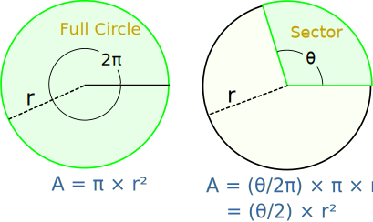

# CV_2_ServletAPP_Circle

# Description:
This web application is built using Java Servlet technology to calculate the area and perimeter of a circle. The user inputs the radius of the circle via a web form, and upon submission, the servlet processes this input, computes the area and perimeter, and displays the result on a new webpage.

# Functionality:

User Input: Users input the radius of the circle into the provided text field on the HTML form.

Data Submission: Upon submitting the form, the entered radius value is sent to the servlet as a parameter in a GET request.

Calculation: The servlet receives the radius parameter, parses it into a numerical value, and calculates the area and perimeter of the circle using the provided radius.

Result Display: The calculated area and perimeter values are then displayed on a new webpage generated by the servlet. This webpage includes HTML markup to present the results in a readable format, typically with appropriate labels and formatting.

# helpful links with more information

[Servlet info ](https://www.geeksforgeeks.org/introduction-java-servlets/)

[Jakarta Servlet ](https://jakarta.ee/learn/docs/jakartaee-tutorial/current/web/servlets/servlets.html)

[Servlet video cz/sk ](https://www.youtube.com/watch?v=z5uvktj66gg)
